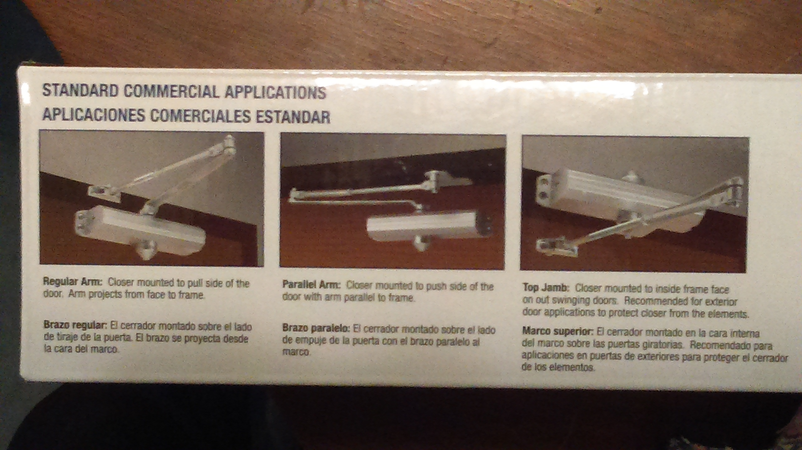

<head>
<meta charset="utf-8">

<title>Doors</title>
</head>

# Doors

## Door closers in general

## Door leading from main stairwell to dining room

* 36" (3 ft) wide
* Right‑hand door
* Door closer installed in the pull‑side of the door.

### New door closer installed 2016‑03

Uncle Will and Pastor installed a new heavy‑duty door closer.
Pastor bought it from Lowe's with money from the youth group account.
We found [this YouTube video from Tell Manufacturing](https://www.youtube.com/watch?v=O_XnXKedp5o) to be very helpful.

<figure>

<figcaption style="clear: left; margin: .75em 0; text-align: center; font-style: italic; line-height: 1.0em;">
We performed a _regular arm installation_, not a _parallel arm installation_ or a _top jamb installation_.
</figcaption>
</figure>

<table>
<tr>
<td align="right">Manufacturer:</td><td>Tell Manufacturing, Inc. (<kbd>www.tellmfg.com</kbd>)</td>
</tr>
<tr>
<td align="right">Model:</td><td>2015.11 600Series641 SIZE 2‑4 (stenciled on inside of closer body)</td>
</tr>
<tr>
<td align="right">Model:</td><td>DC100148 600 SERIES 12641 PA AL (printed on label on the box)</td>
</tr>
</table>

Label on the box says, “25 YEARS WARRANTY.”

* Speed valves should face hinge.
